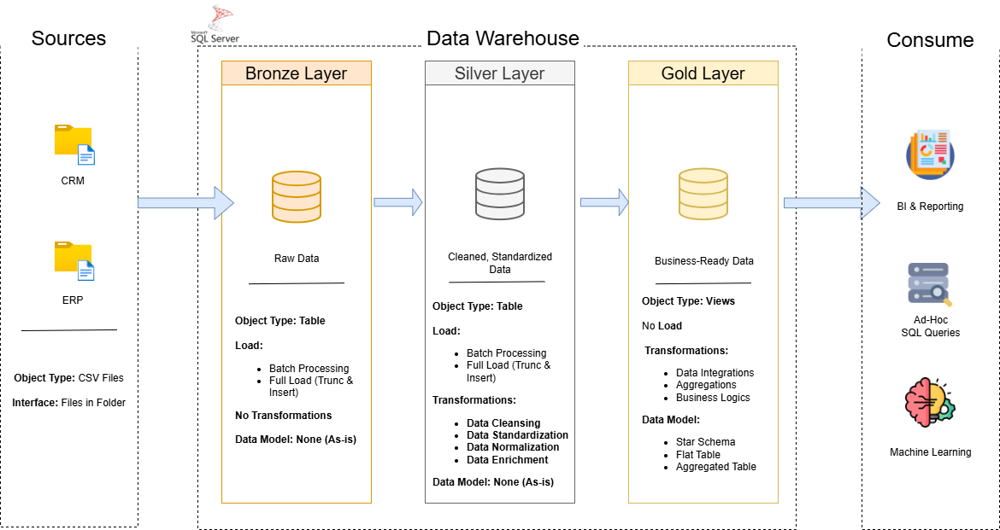

# 🏗️ SQL Data Warehouse — Medallion Architecture

A modern data warehouse project designed using the **Medallion Architecture** principles. This project aims to simulate a real-world ETL data pipeline involving **Bronze**, **Silver**, and **Gold** layers, built entirely with SQL and supported by modular documentation and automation.

---

## 🧠 Project Overview

This project was developed as part of our personal learning journey in data engineering. It is centered around creating a **robust and scalable data warehouse** using SQL and modern data modeling techniques.

We simulated a simplified **e-commerce analytics pipeline** that flows through **raw ingestion**, **cleaning/transformation**, and **business-level aggregation**, following the Medallion Architecture.

> 📌 **Key Focus**: End-to-end pipeline design, modular SQL scripting, reproducibility, and proper documentation.

---

## 🗺️ Data Architecture



Our system is based on the **Medallion Architecture** which splits data into three stages:

- 🥉 **Bronze Layer**: Raw, ingested data (minimal transformations)
- 🥈 **Silver Layer**: Cleaned, normalized data (joins, type casting)
- 🥇 **Gold Layer**: Aggregated, business-ready data (KPIs, dashboards)

---

## ⚙️ Project Requirements

### Building the Data Warehouse 

#### Objective
Develop a modern data warehouse using SQL Server to consolidate sales data, enabling analytical reporting and informed decision-making.

#### Specifications
- **Data Sources**: Import data from two source systems (ERP and CRM) provided as CSV files.
- **Data Quality**: Cleanse and resolve data quality issues prior to analysis.
- **Integration**: Combine both sources into a single, user-friendly data model designed for analytical queries.
- **Scope**: Focus on the latest dataset only; historization of data is not required.
- **Documentation**: Provide clear documentation of the data model to support both business stakeholders and analytics teams.


> 🧰 **Tools Used**:
> - Microsoft SQL Server  
> - SQL Server Management Studio (SSMS)

---

## 📂 Repository Structure
```
sql-data-warehouse-medallion-architecture/
│
├── datasets/                           # Raw datasets used for the project (ERP and CRM data)
│
├── docs/                               # Project documentation and architecture details
│   ├── data_integration.jpg            # Draw.io file shows all different techniquies and methods of ETL
│   ├── DataArchitecture.png            # Draw.io file shows the project's architecture
│   ├── data.catalog.md                 # Catalog of datasets, including field descriptions and metadata
│   ├── data_flow.drawio                # Draw.io file for the data flow diagram
│   ├── data_model.jpg                  # Draw.io file for data models (star schema)
│   ├── naming-conventions.md           # Consistent naming guidelines for tables, columns, and files
│
├── project-plan/
|   ├── master-project-plan.md          # Project plan for whole process we used
|   ├── requirements.md                 # Dependencies and requirements for the project
|
├── scripts/                            # SQL scripts for ETL and transformations
│   ├── bronze/                         # Scripts for extracting and loading raw data
│   ├── silver/                         # Scripts for cleaning and transforming data
│   ├── gold/                           # Scripts for creating analytical models
│
├── tests/                              # Test scripts and quality files
│
├── README.md                           # Project overview and instructions
└── LICENSE                             # License information for the repository
```
---

## 🤝 Collaboration Note 
This project was developed collaboratively by:
* [Mehmet Temel](https://github.com/mhmttml)
* [Burak Gizlice](https://github.com/burakgizlice)

  Together, we:
* Designed the system following modern data architecture principles
* Applied SQL best practices across all ETL layers
* Maintained a clean, modular, and reproducible folder structure
* Documented every layer and design decision
